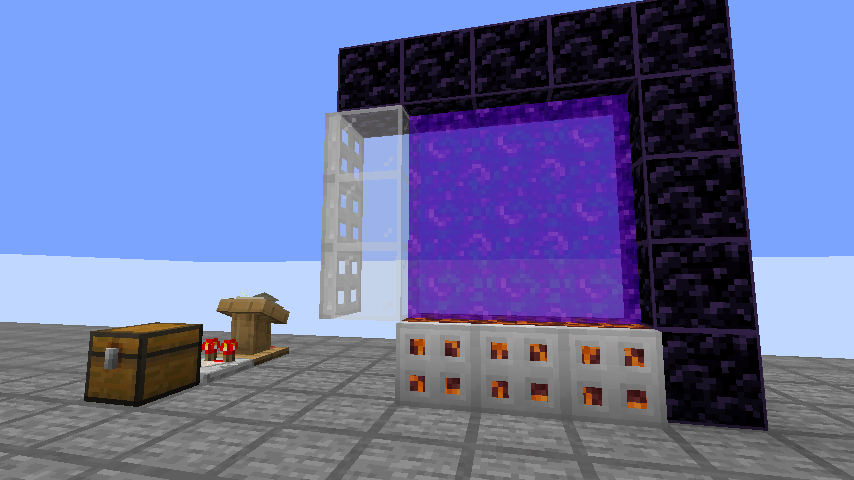

English | [简体中文](Rules_CN.md)

# Rule List

### CobWebResistanceTuner

The first rule of the mod LOL!

Change the Resistance parameter of **CobwebBlock** into **Powdersnow block**, easily understandble as we do not have powdersnow in 1.16. Technically useful for storage tech since these two blocks perform similarly in most cases

* Default Value: `false`
* Optional Parameters: `true`, `false`
* Open Method: `/carpet cobWebResistanceTuner ture`
* Categories: `BLUE` , `feature`

### CrossDimensionProjectileLootFix

A Fix for Player owned projectiles losing their player ownership when exiting portals like 23w41a

Then you can use your CrossDimension Ghast/Arrow->TNT/Firework-based Raid Farm or other powerful farms in lower versions.

* Default Value: `false`
* Optional Parameters: `true`, `false`
* Open Method: `/carpet crossDimensionProjectileLootFix ture`
* Categories: `BLUE` , `survival`, `bugfix`

### TNTInWaterCantHurtBlockLikeEntity

Introduce the magic explosion feature that Damagesource touching water will not hurt BlockLikeEntities in 24w33a, discoverd by KD.

In detail, this rule will make those entities immune from TNTEntity explosion(when TNTEntity's collision box has even a little overlap with water): Armor stand, Item frame and **Item entity**

* Default Value: `false`
* Optional Parameters: `true`, `false`
* Open Method: `/carpet tntInWaterCantHurtBlockLikeEntity ture`
* Categories: `BLUE` , `feature` , `tnt`

### SoundSuppresionIntroduce

Introduce the sound suppressor of a calibrated sculk sensor in 1.20-1.21

Place a trappedChest and name it "SoundSuppresor" or "声音抑制器" and put a lectern at its back with 15 pages, then use the specific channels as you want.

Tips:Only safe channels are transplanted, other channels are not in cosideration yet.

* Default Value: `false`
* Optional Parameters: `true`, `false`
* Open Method: `/carpet soundSuppressionIntroduce ture`
* Categories: `BLUE` , `feature`

| Channel | Function                                          |
| :-----: | ------------------------------------------------- |
|    5    | Shadow Items interacting with armor stand        |
|    9    | suppress when door/trapdoor close                 |
|   10   | suppress when door/trapdoor open                  |
|   10   | TNT block not deleted on fused(TNT looting duper) |
|   10   | suppress when noteblock play                      |
|   11   | suppress when bell rings                          |

### SculkCatalystIntroduce

Introduce the Sculk Catalyst block from 1.19

Now a barrel block with name "sculkcatalyst" or "幽匿催发体" will work like that(absorb experience from entity death), but it wont spread sculk, play animation or update neighboor.

* Default Value: `false`
* Optional Parameters: `true`, `false`
* Open Method: `/carpet sculkCatalystIntroduce ture`
* Categories: `BLUE` , `feature`

### SoftCryingObsidian

Turn its hardness into endstone like the softObsidian rule

* Default Value: `false`
* Optional Parameters: `true`, `false`
* Open Method: `/carpet softCryingObsidian ture`
* Categories: `BLUE` , `feature`

### NewWitchDropIntroduce

~"Totally Not Vanilla"~

Introduce the new witch drop in 1.21+

* Default Value: `false`
* Optional Parameters: `true`, `false`
* Open Method: `/carpet newWitchDropIntroduce ture`
* Categories: `BLUE` , `feature`

### EnderPearlChunkLoader

Introduce the enderPearl Chunk loading in 1.21.2+

* Default Value: `false`
* Optional Parameters: `true`, `false`
* Open Method: Listed in the graph below
* Categories: `BLUE` , `feature`

| List | Name                               | Effect                                                                                          | Tips                                     |
| :--: | :--------------------------------- | :---------------------------------------------------------------------------------------------- | :--------------------------------------- |
|  1  | enderpearlLoadTicketIntroduce      | Ender pearl load chunks in movement                                                             | Cover rule 2                             |
|  2  | enderpearlDiagonalChunkLoader      | Ender pearl will only load chunks when  both X&Z deviation larger than 0.01                | For Lazy Pearl Cannons                   |
|  3  | enderpearlChunkLoaderOnPlayerLogin | Player login will automatically load chunks  containing the pearls he thrown for 40 ticks | Can cooeprate with rule 1 to load chunks |
